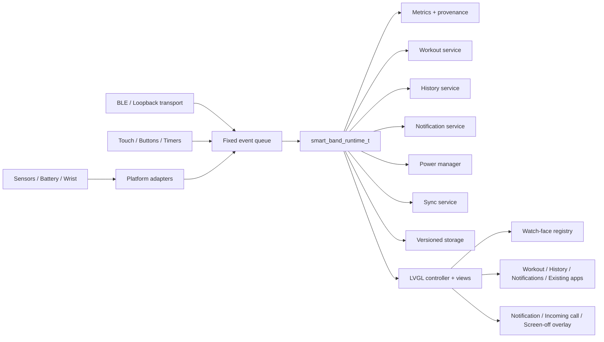

# smart-band-demo 复赛顶配工程路线图

- 更新时间：2026-07-21（Asia/Shanghai）
- 状态：复赛工程主路线，后续对话必须优先读取
- 当前 W1 合并基线：`master` / `bda730fd55e34ea7bdf7e75bfc600da9d75709a2`

## 0. 文档定位与硬边界

这份文档只负责两件事：

1. 智能手环产品功能 A–G 的顶配实现路线。
2. 支撑这些功能的 native 工程、模拟器、开发板、测试、性能和稳定性门禁。

以下事项明确不属于本路线图：

- 视频录制、剪辑和讲解脚本。
- 比赛平台提交、正式发布和面向比赛的打包管理。
- 与复赛 A–G、用户体验、稳定性或硬件适配无关的新小游戏和装饰性功能。

用户管理视频与比赛平台提交事务。GitHub 上的工程提交、推送、分支和 PR 属于持续开发
流程，不受上述排除项限制。

用户确认其对 GitHub 主仓库拥有完整管理权并对仓库负责，长期授权 Codex 按持续开发
需要自主修改、提交、推送以及创建、更新和合并 PR，无需逐次申请。每次提交仍必须保持
范围清晰、历史可追踪，并在对应 Gate 通过后再合并；强制推送、改写已发布历史、删除
远端分支/标签或创建正式 release 仍需当次明确指示。

开发板正在到货途中，型号与 PCB revision 尚未确认。在完成板卡清点、恢复方案和
本次烧录授权前，禁止写入 flash、烧录固件或更改 bootloader。

## 1. 一句话战略

当前项目是一个工程质量很强的初赛基线，但复赛 A–G 尚未形成完整垂直闭环。顶配
路线不是继续堆小应用，而是建立共享运行时与数据底座，然后依次完成：

```text
native E2E + runtime/storage 基础
  -> A 多表盘
  -> B 运动记录 + D 持久化/历史
  -> C 消息提醒
  -> E 低功耗
  -> F 蓝牙同步
  -> G 开发板适配
  -> 全功能长稳、功耗和故障恢复
```

其中 B 与 D 必须联做；C、E、F 必须复用同一事件队列、通知模型和平台能力层；G
只替换 platform/transport/provider，不重新实现业务逻辑。

## 2. 当前真实基线

### 2.1 已经具备

- openvela/NuttX 原生 C + LVGL 应用入口。
- 表盘、心率、计步、应用中心四个主页面。
- 左右滑动、圆点导航、应用进入/返回和按钮交互代码。
- 心率、计步、加速度、温度、湿度、电池和充电状态 provider。
- 真实传感器、派生数据、模拟数据、fresh/stale/TTL 的来源模型。
- Weather、Calculator、Timer、2048、Stopwatch、Mines、Tetris、Wooden Fish 八个小应用。
- 应用 registry、静态 context、owned LVGL container 和 mount/unmount 生命周期。
- GCC、Clang、MSVC 严格警告，生产 C 测试和覆盖率门禁。
- Browser 响应式、对比度、焦点、触控尺寸和 reduced-motion 测试。
- 固定版本 openvela 构建、真实 emulator/NSH/native process smoke。
- Q1-V 已用 native framebuffer 证明固定 `1280x800` 表盘、一次滑动到 Heart Rate，
  以及注入 `104` 后的 fresh sensor UI/结构化状态。
- fixed-release native smoke 已确认 `smart_band: UI ready`，该 smoke 本身只证明启动与短时存活。
- W1 已用迁移前 reference 对 `336x480` compact 与 `1280x800` framed Lotus 做动态区域
  mask 后逐像素回归，并证明第一次横滑进入 Heart Rate。
- Q2 已完成三表盘、600ms 长按 picker、Q1-S settings、100 次切换和 compact/framed native
  Activity/Minimal framebuffer journey。

### 2.2 仍未证明

- Q2 之外的全页面/应用 native 像素和长时视觉回归。
- 已证明的 Q2 picker 与一次 native 滑动之外，所有应用按钮和复杂跨功能手势的端到端行为。
- 已证明的 heart-rate fresh sensor 帧之外，stale/TTL fallback、来源切换和其他 sensor UI。
- 两小时以上模拟器长稳、八小时以上最终长稳。
- 存储损坏、掉电半写、空间不足和版本迁移恢复。
- BLE 协议、重连、分片、幂等和真实 GATT。
- 真机显示、触摸、传感器、存储、震动、BLE 和功耗。

### 2.3 复赛 A–G 当前状态

| 任务 | 当前状态 | 结论 |
| --- | --- | --- |
| A 多表盘 | 完成 | 三表盘、picker/settings、100 次切换和双分辨率 native Gate 全绿 |
| B 运动记录 | pure core ready | step normalizer 与 Walk/Run model 已有；service/UI/history 未接 |
| C 消息提醒 | pure core ready | 固定通知模型/demo 已有；center/overlay/call/haptic 未接 |
| D 持久化/历史 | 部分基础 | Q1-S store 与 workout snapshot 数据已有；daily/history 尚未实现 |
| E 低功耗 | pure core ready | ACTIVE/DIM/OFF policy 已有；runtime/platform/真机功耗未接 |
| F 蓝牙同步 | envelope core ready | v1 codec/vector 已有；session/transport/client/BLE 未完成 |
| G 开发板适配 | 未完成 | 板型未知，无 BSP/defconfig/board port |

### 2.4 已关闭问题不得重做

PR1–PR8 已经闭环生命周期、数据来源、应用 runtime、UI/CI、固定 openvela 构建和
native smoke。后续只有在新证据证明回归时才能重新打开这些问题。单纯重构旧代码、
重写已有小游戏或重复已有测试不算复赛进展。

## 3. 顶配完成定义

### 3.1 产品完成定义

顶配产品至少同时满足：

- 三种可切换且可持久化的表盘。
- Walk、Run 两种完整运动会话。
- 运动时长、步数、距离、卡路里、当前/平均/最高心率和结束摘要。
- 30 天每日摘要、最近 30 次运动记录和至少 7 天趋势图。
- Call、SMS、App 三类模拟通知，包含通知中心、弹层、来电全屏和震动反馈。
- ACTIVE、DIMMED、SCREEN_OFF 三态功耗策略，支持触摸、抬腕、通知和充电唤醒。
- 版本化 BLE 同步协议，支持 live metrics、历史、配置和通知下发。
- 在实际开发板运行，真实显示、触摸、存储、传感器、震动、BLE 与功耗均有验证。

### 3.2 工程完成定义

- LVGL 只在 UI 线程操作；BLE、传感器和硬件回调只能投递事件。
- 重要业务状态不存放在 LVGL 对象或临时 view context 中。
- 墙钟只用于日期与记录时间；运动时长、超时和动画全部使用单调时钟。
- 存储采用版本化编码、CRC 和可恢复提交，不直接落盘 C struct。
- 每项功能都有纯逻辑测试、UI 行为测试和 native 垂直闭环。
- 模拟器结果不得冒充真机结果，软件降频结果不得冒充功耗实测。
- 所有 Gate 均以自动化日志、结构化结果或测量数据判定，不能凭肉眼或描述勾选。

## 4. 目标架构

### 4.1 总体关系



### 4.2 中央运行时

引入 `smart_band_runtime_t`，统一持有领域状态与服务，不让 `app_lvgl.c` 继续成为所有
功能的全局汇聚点：

```c
typedef struct
{
  smart_band_state_t metrics;
  smart_band_settings_t settings;
  smart_band_workout_t workout;
  smart_band_history_t history;
  smart_band_notification_store_t notifications;
  smart_band_power_t power;
  smart_band_sync_t sync;
  smart_band_event_queue_t events;
  smart_band_capabilities_t capabilities;
} smart_band_runtime_t;
```

原则：

- `app_lvgl.c` 逐步只保留 UI controller、router 和 view 生命周期。
- 后台运动、历史累计、通知队列和同步不能依赖某个页面是否 mounted。
- 现有八个小应用进入维护模式；新增 Workout、History、Notifications、Settings
  是系统功能，不复制现有小应用内部状态。
- 不为拆文件而拆文件；每次拆分必须服务于一个正在实现的复赛垂直切片。

### 4.3 事件队列

使用定长、无堆分配的 `smart_band_event_t`：

```c
typedef struct
{
  smart_band_event_type_t type;
  uint32_t monotonic_ms;
  smart_band_event_payload_t payload;
} smart_band_event_t;
```

首批事件至少包含：

- `METRICS_UPDATED`
- `TOUCH_ACTIVITY`
- `WRIST_RAISED`
- `WORKOUT_COMMAND`
- `WORKOUT_CHECKPOINT`
- `NOTIFICATION_RECEIVED`
- `NOTIFICATION_ACTION`
- `POWER_TIMEOUT`
- `BLE_CONNECTED` / `BLE_DISCONNECTED`
- `SYNC_REQUEST` / `SYNC_ACK`
- `STORAGE_FLUSH_REQUEST`

队列必须定义满载策略。高优先级来电、掉电 checkpoint 和控制事件不能被普通 metrics
刷新挤掉；低优先级重复刷新允许合并。

### 4.4 平台能力层

新增 `smart_band_platform_t` 与 `smart_band_capabilities_t`，能力至少覆盖：

- display / backlight
- touch / physical button
- monotonic clock / RTC
- storage
- heart / step / accel / temperature / humidity
- battery / charging
- wrist gesture
- vibrator
- BLE
- sleep / wake

模拟器与真机都通过同一接口。能力缺失必须返回明确状态并降级，不能使用散落在 UI 中
的 `#ifdef`。到货前不得假设板卡一定具有某个传感器、震动器或 BLE 控制器。

### 4.5 建议目录

```text
openvela_app/smart_band/
  include/
    smart_band_runtime.h
    smart_band_event.h
    smart_band_settings.h
    smart_band_workout.h
    smart_band_history.h
    smart_band_notification.h
    smart_band_power.h
    smart_band_storage.h
    smart_band_sync_protocol.h
    smart_band_sync_transport.h
    smart_band_platform.h
  logic/
    event_queue.c
    settings_model.c
    workout_model.c
    history_model.c
    notification_model.c
    power_model.c
    sync_protocol.c
  services/
    runtime.c
    workout_service.c
    history_service.c
    notification_service.c
    power_manager.c
    storage_service.c
    sync_service.c
  platform/
    nuttx/platform_nuttx.c
    nuttx/storage_nuttx.c
    nuttx/haptic_nuttx.c
    nuttx/power_nuttx.c
    loopback/sync_loopback.c
    board/<confirmed-board>/...
  ui/lvgl/
    controller.c
    router.c
    overlay.c
    watch_faces/
      watch_face_registry.c
      face_lotus.c
      face_activity.c
      face_minimal.c
    views/
      workout_view.c
      history_view.c
      notifications_view.c
      settings_view.c
```

目录是目标形态，不要求一次性大搬迁。每次只移动本阶段实际修改的代码，并保持所有
现有构建入口同步。

## 5. 共享数据契约

### 5.1 Settings

`smart_band_settings_t` 至少包含：

- schema version
- active watch-face ID
- step goal
- brightness
- dim timeout
- screen-off timeout
- weight / height / walking stride / running stride
- notification enable / DND window
- wrist-wake enable
- sync interval

所有字段必须有默认值、范围校验和旧版本迁移。

### 5.2 Workout

状态机固定为：

```text
IDLE -> COUNTDOWN -> RUNNING <-> PAUSED -> FINISHED
                              \-> ABORTED
```

记录至少包含：

- mode: Walk / Run
- start/end wall-clock timestamp
- accumulated monotonic duration
- normalized step delta
- estimated distance
- estimated calories
- current/average/max heart rate
- pause count
- data source flags
- completion/recovery status

距离与卡路里必须标记为 estimated。推荐公式：

```text
distance = normalized_steps * configured_stride
kcal = MET * 3.5 * weight_kg / 200 * active_minutes
```

公式、默认体重、步幅和 MET 必须集中定义并可测试，不能散落在 UI 文案中。

### 5.3 History

顶配目标：

- 30 天 daily summary ring。
- 最近 30 次 workout session。
- UI 至少显示连续 7 天趋势、缺失日、每日详情和运动详情。
- 跨午夜结算，支持 RTC 无效、日期回拨、步数计数器归零/回绕。

`smart_band_daily_summary_t` 至少包含日期键、步数、运动秒数、卡路里、心率 min/max/avg、
完整性标志和来源标志。

### 5.4 Notification

固定容量通知队列，不使用无界字符串：

- ID
- type: Call / SMS / App / System
- priority
- source
- title
- body
- wall-clock timestamp
- read/dismissed/action state

溢出策略固定为：优先删除最旧、低优先级、已读通知；高优先级未处理来电不能被普通
App 通知淘汰。

### 5.5 Power

状态机：

```text
ACTIVE -> DIMMED -> SCREEN_OFF
   ^         |          |
   +---------+----------+
      touch / wrist / notification / charging / button
```

状态中保存：最后交互时间、进入时间、唤醒原因、目标亮度、UI 更新周期、传感器采样策略和
允许的后台任务。

### 5.6 Storage

禁止直接 `write(fd, &struct, sizeof(struct))`。存储格式至少包含：

- magic
- schema major/minor
- record type
- generation/sequence
- payload length
- payload
- CRC32

优先使用 `temp -> flush/fsync -> rename` 原子提交；若目标文件系统不能保证 rename
语义，则使用 A/B 双槽与 generation 选择最近有效代。

写入策略：

- settings 只在用户确认后写。
- workout 每 30 秒和状态转换 checkpoint。
- daily summary 批量聚合，不得每秒写 flash。
- 低电量/关机事件请求紧急 checkpoint。
- ENOSPC、EIO、EROFS、短写和 CRC 错误必须可恢复，UI 仍可进入只读模式。

### 5.7 Sync protocol

协议与 BLE 完全分离。所有多字节字段固定 little-endian；帧包含：

- protocol major/minor
- frame type
- payload length
- transaction ID
- sequence/chunk index
- flags/status
- CRC16

必须拒绝超长、未知 major、非法长度、重复、乱序和非法状态转换。

## 6. A–G 顶配产品规格

### 6.1 A：多表盘

目标不是最低要求的两款，而是三款：

1. `Lotus Health`：保留当前视觉，突出健康摘要。
2. `Activity Rings`：突出步数、运动进度、卡路里和心率区间。
3. `Minimal Digital`：大时间、日期、电量，息屏/低刷新友好。

交互：

- 长按当前表盘进入表盘选择器。
- 左右滑动预览，点击确认。
- 切换只 mount 一个表盘 owned container，不同时常驻三套对象树。
- 选择结果写入 settings，重启恢复。
- 普通页面横滑与长按/预览手势由统一 router 仲裁。

A Gate：

- 三款表盘数据语义一致。
- 连续切换 100 次无对象、fd、callback 净增长。
- 两种基准分辨率无裁切或不可点击控件。
- 重启、存储损坏和旧 settings 版本均能选择有效默认表盘。

### 6.2 B：运动记录

至少实现 Walk 与 Run：

- 三秒倒计时。
- 开始、暂停、恢复、结束、放弃。
- 当前时长、步数、距离、卡路里、当前心率。
- 平均/最高心率、平均配速和结束摘要。
- 离开运动页后继续记录。
- 运行时 screen off 不丢计时与步数。
- 异常重启恢复为“待确认暂停态”，禁止静默继续计时。

步数必须经过归一化器，处理：

- 设备计步器归零。
- 32 位回绕。
- sensor -> derived -> simulation 来源切换。
- stale 数据恢复。
- 突然大跳和负增量。

B Gate：

- 24 小时加速测试无溢出。
- 暂停期间运动时长和 active metrics 不增加。
- 来源切换不产生负数或不合理突增。
- 完成记录与 D 历史逐字段一致。

### 6.3 C：消息提醒

产品面：

- 通知中心。
- 普通通知顶部/中部弹层。
- 来电全屏层，Accept / Reject。
- Call、SMS、App 三类确定性模拟入口。
- 震动 pattern：普通、重要、来电。
- DND 与运动中非阻断模式。
- 高优先级通知可请求唤醒屏幕。

输入适配：

- 内置 deterministic demo injector。
- host/模拟器 ingress。
- F 阶段复用 BLE Notification Inbox。
- simulator 无震动器时记录结构化 haptic log，不伪装成真实震动。

C Gate：

- 弹出、超时、已读、删除、Accept/Reject 完整。
- 超长文本截断/滚动策略稳定。
- 重复 ID 幂等。
- 连续注入和队列满载不崩溃。
- overlay 捕获输入，不误触底层按钮或横滑。

### 6.4 D：持久化与历史

产品面：

- 7 天步数/卡路里/运动分钟趋势。
- 30 天数据保留。
- 每日详情。
- 最近 30 次运动列表与详情。
- 缺失日明确显示，不用 0 冒充真实测量。
- 数据来源与完整性可在详情中查看。

D Gate：

- 跨午夜、RTC 无效、时钟回拨正确。
- temp 半写、单槽损坏、CRC 错误、旧版本和 ENOSPC 均有测试。
- 重启只能读取旧完整代或新完整代，不能读到混合数据。
- 30 天循环覆盖不破坏最新记录。
- 不存在每秒 flash 写入。

### 6.5 E：低功耗

策略：

- ACTIVE：正常亮度与交互刷新。
- DIMMED：降低亮度与动画/刷新。
- SCREEN_OFF：关闭背光/显示刷新，仅保留必要后台服务。
- 非运动息屏时降低心率轮询，优先依赖硬件 step counter。
- 运动中息屏保留必要采样。
- 触摸、物理键、抬腕、高优先级通知和充电可唤醒。

E Gate：

- 息屏后周期 LVGL render 次数降低至少 90%。
- 非运动息屏心率轮询降低至少 80%。
- 模拟器唤醒延迟目标小于 300 ms。
- 息屏期间运动、通知和 checkpoint 连续。
- 真机使用功耗仪验证 ACTIVE、DIMMED、SCREEN_OFF、WORKOUT、BLE SYNC；软件日志
  只能证明策略，不得作为实际电流结论。

### 6.6 F：蓝牙数据同步

产品形态：手环为 BLE Peripheral/GATT Server，Linux 上位机或手机为 Central。

分层：

- `sync_protocol`：纯 C codec、版本、游标、CRC 和错误码。
- `sync_service`：快照、历史、断点、去重和配置。
- `sync_transport`：`start/stop/send/poll/status/mtu`。
- transport 实现：host loopback、模拟器 bridge、目标板 openvela BLE。

优先复用标准 Heart Rate Service 与 Battery Service；自定义 128-bit 服务承载：

| Characteristic | 属性 | 内容 |
| --- | --- | --- |
| Capabilities | Read | 协议版本、feature bits、MTU、板卡标识 |
| Live Metrics | Read/Notify | 步数、心率、电量、运动、卡路里、来源 |
| History Control | Write/Response | 时间范围、事务号、游标、取消/重试 |
| History Data | Notify | 分片记录、事务号、序号、末包标志 |
| History Ack | Write | 应用层确认与断点游标 |
| Device Config | Write/Response | 校时、目标步数、采样/同步设置 |
| Notification Inbox | Write/Response | 手机到手环通知 |

F Gate：

- 协议黄金向量和畸形包测试通过。
- loopback 注入丢包、重复、乱序、断连后，7 天历史逐字节一致。
- Linux Bleak 客户端完成发现、订阅、配置、同步和重连续传。
- 真板 100 次连接/断开、1000 次通知无崩溃、死锁、重复历史。
- 未验证 pairing/encryption 前不得宣称安全同步。

### 6.7 G：开发板适配

到货前只实现 capability 与 platform 边界，不绑定未知 BSP。到货后按第 9 节的硬件
流程执行。

G Gate：

- 准确板型、revision、SoC、RAM/Flash 和恢复流程明确。
- NSH、显示、背光、触摸、RTC、存储、电池、震动、传感器逐项通过。
- 应用先以 simulation mode 运行，再逐项切换真实 provider。
- BLE、低功耗、掉电恢复和看门狗通过。
- 8 小时交互压力和 24 小时待机稳定，无崩溃、损坏、异常发热或无法恢复。

## 7. 总体阶段与质量门禁

阶段可以跨多个对话，但每个对话只能推进一个可验收垂直切片。禁止在前一 Gate 仍红时
同时铺开多个互相依赖的大功能。

### 7.1 远端 Linux 执行入口与边界

用户提供的入口：

```text
E:\C_Moved_From_C\Users\Lenovo\Desktop\AI Gateway 工具\Remote Codex.cmd
```

该入口连接远端 Linux 并从 `/home/ubuntu` 启动 Codex。现有独立 simulator 工作区：

```text
/home/ubuntu/smart-band-sim-20260720-v1
  openvela/
  smart-band-demo/
  evidence/
```

用户确认该远端提供 `150G` 磁盘容量，足以承载独立 openvela 源码 checkout、构建目录和
阶段性 evidence，当前无需另租服务器。大型拉取或构建前仍须用 `df`/`lsblk` 确认
`150G` 对应的实际挂载点和剩余空间，并把新工作区放在该挂载点；不得仅依据根文件系统
的容量作结论。

安全约定：

- 不把 SSH key、token 或凭据复制进仓库、日志或路线图。
- 每次先确认 `pwd`、磁盘、目标目录、git 状态、相关进程和端口。
- 只操作本项目独立目录与本轮启动的进程组，不触碰远端其他项目。
- 失败 evidence 先保留，再决定是否重跑；不得用新空目录掩盖旧失败。
- 远端源码与本地源码有差异时先报告并使用新的隔离 snapshot，不覆盖或复用来源不明、
  过期或 dirty 的远端工作树。GitHub 提交与推送按本路线图的长期授权正常执行。

### Q0：基线冻结

目标：确认后续回归比较基准，不修改产品功能。

任务：

- 记录当前 `master`、固定 openvela/emulator/tool revisions 和 NuttX SHA。
- 重跑现有 Host、Browser、Shell、fixed build/native smoke。
- 记录当前应用启动时间、二进制/map、静态资源大小和可用磁盘。
- 把当前 native 未证明事项保留为红项，禁止因为 Browser 通过而勾选。

退出条件：

- 现有门禁全绿。
- 基线证据可定位。
- 没有来源不明的本地改动。

Q0 已于 2026-07-20 经最终审计重跑完成：20/20 次独立冷启动通过，
`smart_band -> UI ready` p50/p95/max 为 `0.8065/0.821/0.828 s`，emulator -> NSH 为
`1.312/1.364/1.406 s`。每轮四个固定输入均为独立副本，源 artifact
逐轮及批次前后 SHA 不变；Host/Browser/Shell/fixed build receipt、源码树 manifest、
ELF section/明确符号锚点、`2,027,043` bytes 静态资源、磁盘、543 项 evidence SHA 和
严格 PGID/端口清理
同时通过。保留 artifact 没有 linker 原始 map，因此明确标记为 `elf-symbol-map`。
receipt 绑定 `master@1ddc533` 的 Host run `29730739442` 与 Browser run `29730739529`。
首轮未隔离数据盘和中间 `q0-audit-hardened-20260720T1953CST` 只作保留证据，不再作为
Gate 依据。完整记录见
`docs/q0-q1v-baseline-20260720.md`；正式目录为
`/home/ubuntu/smart-band-sim-20260720-v1/evidence/q0-final-audited-20260720T2034CST`。

### Q1：可测试运行时与 native E2E 基础

这一阶段有两条可并行工作流，必须在进入大规模产品开发前汇合。

#### Q1-V：native 可视化与输入 E2E

任务：

- 在远端 Linux 研究固定 emulator 支持的 windowed/Xvfb、截图和输入注入方式。
- 优先使用 emulator 原生能力；若不可用，再选择 X11 工具、触摸设备注入或 NuttX
  input bridge，不能用浏览器截图替代。
- 支持固定时间或动态区域 mask，避免时钟导致像素比较无意义。
- 建立至少三条旅程：启动到表盘、滑动到心率页、传感器注入后值变化。
- 同时断言截图、结构化日志和 NSH 状态，不只比像素。

退出条件：

- 有一张可确认来自 native framebuffer/emulator 的表盘截图。
- 至少一次真实 native 滑动或等价输入注入改变页面。
- 至少一种传感器注入改变 native UI，并能断言 source/freshness。
- emulator 进程、端口、临时图形服务全部清理。

若两种合理输入方案都被固定 emulator 能力阻塞，可以暂时推进 Q1-C，但必须把精确
阻塞、日志和下一验证路径写入交接；不得把 Q1-V 标绿。

Q1-V 已于 2026-07-20 经最终审计重跑完成：console framebuffer 生成三张 native PNG，
goldfish touchscreen 滑动进入心率页，启用独立 emulator heart-rate capability 后注入
`104`。除区域变化外，`Heart Rate`、`104 bpm`、`Source / Sensor` 三处审阅后 RGBA
golden ROI 精确匹配，结构化状态为
`page=heart_rate, value_bpm=104, source=sensor, freshness=fresh`。这只证明当前 fresh sensor
帧，不证明 stale/TTL fallback。四个运行输入全部隔离复制，NSH、console、PID、固定
artifact 前后 SHA、51 项 evidence manifest 和最终清理同时通过；首次 swipe attempt 成功。
远端 `q1v-final-audited-20260720T2026CST` 曾在 console 接受 swipe 但页面未变化时被 title golden
正确判失败。首轮仅使用变化像素和只读 hardlink 的结果，以及中间
`q1v-audit-hardened-20260720T1950CST`，都只作保留证据。正式目录为
`/home/ubuntu/smart-band-sim-20260720-v1/evidence/q1v-final-audited-20260720T2031CST`，完整记录同上。

#### Q1-C：runtime、事件与可注入平台

任务：

- 引入 `smart_band_runtime_t`、定长事件队列、clock abstraction 和 capability model。
- 把模型/传感器/app tick 顺序移入 controller/runtime。
- 使用 dirty flags，避免每秒无差别刷新所有页面。
- 给 storage、power、haptic、sync 建立可注入接口，先提供 no-op/loopback 实现。
- 升级 fake LVGL：至少支持对象树、文本、flag、event、timer、虚拟 tick 和创建失败注入。
- 不在本阶段改变用户可见功能。

退出条件：

- 现有功能零回归。
- event queue 满载、优先级、tick 回绕和墙钟回拨单测通过。
- 逐个注入第 N 次 UI 创建失败时可清理并重试。
- 新增纯逻辑生产代码覆盖率不低于 90%，总体不低于现有 85%。

Q1-C 已于 2026-07-20 完成。central runtime、优先级主队列、带锁外部 inbox、可注入
clock/capability/platform、dirty flags、no-op 和固定内存 sync loopback 均已接线；外部
callback 只入 inbox，UI tick 负责串行化，deinit 先停 transport 再关闭 inbox。fake LVGL
已覆盖对象树、递归清理、文本、flag、event、timer、虚拟 tick/wrap、live counters 和
创建失败注入。compact/framed 主布局及 8 个 lazy app 的全部创建调用逐点失败后均可清理
并重试，1000 次完整 UI 生命周期 object/event/timer 零净增长。Linux GCC/gcov 总覆盖率
`90.9% (1388/1527)`，7 个新增生产源文件各自 `>=90%`；固定版本 openvela fresh/incremental
构建和 native Heart Rate 旅程通过。证据见 `docs/q1c-runtime-platform-20260720.md` 与
`docs/evidence/q1c-gate-summary-20260720.json`。本切片没有实现 Q1-S 或 A-G 功能。

#### Q1-S：存储 codec 与故障后端

任务：

- 定义 storage header、record type、schema、CRC 和 generation。
- 实现 memory backend 与 NuttX file backend。
- 建立 A/B slot 或确认目标文件系统的原子 rename 语义。
- 加入短写、EIO、ENOSPC、EROFS、截断、CRC、旧版本和写中断故障注入。

退出条件：

- 重启只能读取旧完整代或新完整代。
- 单槽损坏可从另一槽恢复。
- 双槽损坏回退默认值并进入可观测 degraded 状态。
- 失败不阻塞 UI 启动。

Q1-S 已于 2026-07-21 完成。格式使用显式 36-byte little-endian header、header/payload
CRC32、schema 与 64-bit generation；A/B store 支持迁移、单槽回退、双槽降级、同代冲突
检测和不确定读失败时 write-before-read 保护。memory/file backend 与 160 个逐字节 crash
切点覆盖短写、写中断、截断、腐坏、EIO、ENOSPC 和 EROFS。Linux 总覆盖率为
`92.2% (2125/2305)`，5 个 Q1-S 生产源文件各自 `>=90%`。固定 openvela run
`29806148523` 在提交 `a9d5a43` 上完成 build、链接校验和 native smoke；此前 run
`29805084515` 暴露的 NuttX `file_read/file_write` 符号冲突已修复并保留失败证据。host/default
no-op 结果不证明目标板文件系统的掉电 durability，详见
`docs/q1s-versioned-storage-20260721.md`。

Q1 总 Gate：Q1-V、Q1-C、Q1-S 全绿；若仅 Q1-V 因固定 emulator 客观阻塞，需经用户
确认后才允许带红项进入 A，且必须在硬件到货后优先补齐。

### Q2：A 多表盘垂直闭环

实现顺序：

1. `watch_face_ops_t` 与 registry。
2. 把现有表盘迁入 `face_lotus.c`，保证零视觉回归。
3. 实现 Activity 与 Minimal。
4. 表盘选择器、手势仲裁和 lazy mount。
5. settings 持久化和损坏回退。
6. host/fake LVGL/native E2E/100 次切换压力。

退出条件：第 6.1 节 A Gate 全过，且没有扩大 app context 常驻内存。

Q2 于 2026-07-21 完成步骤 1-6。三款表盘共享单个 256-byte context，稳态只 mount 一棵
face subtree；picker 不 mount 预览表盘。100 次用户可见切换无 object/event callback 净增长，
非空 file backend 100 次 commit 的 Linux fd 为 `3 -> 3`。compact/framed native 均实际选择
Activity 与 Minimal；Lotus mask 外分别 `146941` 与 `989570` 像素零差异，第一次横滑进入
Heart Rate。Q2 A Gate 全绿，证据见 `docs/q2-multi-watch-faces-20260721.md`。

### Q3：B 运动 + D 历史数据闭环

#### Q3-1：步数归一化与 workout model

- 先解决 reset、wrap、source switch、stale 和异常跳变。
- 再实现 Walk/Run 状态机、单调时间与统计聚合。
- 所有计算先在 host 纯 C 测试完成，不先做页面。

W1 已完成 Q3-1 pure core：step normalizer 与 Walk/Run model 通过三编译器与逐文件 coverage
门禁，但未接 runtime、sensor adapter、storage、service 或 UI。

#### Q3-2：后台 workout service

- 运动离开页面继续。
- pause/finish/abort/checkpoint 独立于 LVGL view。
- 异常重启恢复为待确认暂停态。

#### Q3-3：Workout UI

- 模式选择、倒计时、实时页、暂停页、结束摘要。
- 先用 synthetic modal/input-capture contract 验证横滑不能打断关键确认动作；真实通知
  overlay 在 Q4 接入，并在 Q8 做跨功能复验。

#### Q3-4：Daily/Workout persistence

- 30 天 daily ring、30 次 session。
- 30 秒和状态转换 checkpoint。
- 跨午夜、时钟回拨与无效 RTC。

#### Q3-5：History UI

- 7 天趋势、缺失日、每日详情、运动详情。
- 小屏图表使用固定容量点和清晰单位，不引入重量级 chart dependency。

退出条件：B Gate、D Gate、存储故障矩阵和 30 分钟 workout/history soak 全过。

### Q4：C 消息提醒垂直闭环

实现顺序：

1. notification model 与满载策略。
2. deterministic demo injector。
3. notification center。
4. 普通 overlay。
5. 来电全屏层与 actions。
6. haptic interface 与 simulator structured log。
7. 与 workout 真实集成；为 power 定义 synthetic `wake_request` contract，实际唤醒在
   Q5 接入并在 Q8 复验；BLE ingress 只通过既定 notification adapter 接入。

退出条件：C Gate 全过；1000 条混合通知压力、超长文本、重复 ID 和 overlay 输入隔离通过。

W1 已完成步骤 1-2 的 pure core：固定容量 notification model、满载/保护来电/action/DND/
workout presentation decision 与 deterministic demo 通过；步骤 3-7 尚未接产品。

### Q5：E 低功耗策略闭环

实现顺序：

1. 纯 C power model 与 wake reason。
2. idle/dim/off timer。
3. UI render 与 animation 调度降频。
4. 传感器采样策略。
5. touch/notification/charging wake。
6. wrist-tilt provider；模拟器脚本现有 wrist-tilt 注入必须真正进入 native bridge。
7. platform backlight/display/sleep hooks。

退出条件：

- E Gate 软件策略通过。
- 30 分钟 ACTIVE/DIM/OFF 循环无状态卡死。
- 1000 次亮灭屏无对象、timer 或 fd 净增长。
- 真机到货前只标记“策略完成”，实际功耗 Gate 保持红色。

W1 已完成步骤 1 的 pure policy：状态、wake reason 与 snapshot contract 通过；timer、调度、
sensor/platform adapter、wrist 和实测功耗均未完成。

### Q6：F 协议、loopback 与真实 BLE

#### Q6-1：协议冻结

- 写清 v1 frame、字段、错误码、feature bits 和 GATT mapping。
- 生成 golden vectors。
- codec 在 GCC/Clang/MSVC 下通过边界与畸形包测试。

W1 已完成无状态 v1 envelope codec、CRC/golden vector 和畸形 frame 矩阵；业务 payload、
transaction/session、分片/重试、GATT mapping 与真实 BLE 尚未完成。

#### Q6-2：loopback transport

- 模拟 MTU、分片、延迟、丢包、重复、乱序和断连。
- 7/30 天历史同步、配置写入和通知下发幂等。

#### Q6-3：Linux client

- 使用独立 Python/Bleak 工具验证发现、订阅、配置、历史和重连。
- client 是工程验证工具，不把协议正确性绑定到某个 GUI。

#### Q6-4：目标板 BLE transport

- 板卡与 openvela BLE stack 确认后实现。
- BLE callback 只投递 event，不直接访问 LVGL 或 storage internals。
- pairing/bonding/encryption 只在真实验证后声明。

退出条件：Q6-1–Q6-4 全过；若开发板 BLE 硬件缺失，loopback 与协议可以完成，但 F 总 Gate
保持“部分完成”，不得伪造真实 BLE。

### Q7：G 开发板分层适配

硬件到货后可与 Q2–Q6 的纯逻辑工作并行启动 HW0/HW1，但板卡业务集成必须复用已经冻结
的 runtime/platform/transport 接口。

执行第 9 节完整 bring-up 梯子，不允许跳过恢复、显示触摸或存储基础直接跑应用。

退出条件：第 6.7 节 G Gate 和第 9.4 节硬件验收全过。

### Q8：顶配集成与长稳

完整用户旅程：

```text
冷启动
 -> 恢复表盘与历史
 -> 切换表盘
 -> 开始 Run
 -> 息屏继续记录
 -> 抬腕唤醒
 -> 收到通知并处理
 -> 结束运动并写入历史
 -> BLE 同步
 -> 重启后核对一致性
```

退出条件：

- 模拟器全旅程 E2E、存储故障、BLE loopback 和 2 小时 soak 全过。
- 最终模拟器与真机各完成 8 小时交互压力。
- 真机完成 24 小时待机、100 次 BLE 重连和断电恢复。
- 零 P0/P1 缺陷；P2 必须有明确边界与回归用例。

## 8. 分层测试矩阵

| 层级 | 必测内容 | 通过标准 |
| --- | --- | --- |
| Host 纯 C | face/settings、workout、history、notification、power、codec | GCC/Clang/MSVC `-Werror`；新增逻辑覆盖率 ≥90% |
| fake LVGL | 对象树、文本、flag、event、timer、失败注入 | 1000 次 create/destroy 与导航无净增长；失败可重试 |
| Browser | 设计参考、响应式、可访问性 | 只做设计回归，不作为 native 功能证据 |
| Native headless | NSH、console、UI ready、PID、fatal、清理 | 每个固定版本 smoke 结构化通过 |
| Native 可视 E2E | 截图、触摸/滑动、弹层、表盘、运动、历史 | 动态区域 mask 后像素/结构断言通过，无裁切黑屏误触 |
| Sensor E2E | heart/step/accel/temp/humi/battery/wrist | UI 与日志同时断言 value/source/freshness/fallback |
| Storage fault | 短写、EIO、ENOSPC、只读、截断、CRC、旧版本 | 旧完整或新完整；损坏隔离；应用可启动 |
| Sync/BLE | codec、MTU、分片、乱序、重复、重连、幂等 | 无越界；无丢失/重复历史；断点恢复一致 |
| Board | display/touch/RTC/storage/sensor/haptic/BLE/power | 冷启动、断电恢复、全功能、功耗和长稳通过 |

### 8.1 Golden screenshot 规则

- Golden 必须来自 native emulator 或真机 framebuffer，不来自 Browser。
- 时间、步数等动态区域使用固定时钟或 mask。
- 除像素外同时断言页面 ID、关键文本和输入结果。
- 大面积差异、clipping、黑屏和触控区域漂移直接失败。
- 若使用 SSIM，动态区域处理后目标不低于 0.995；不能用低阈值掩盖布局回归。

### 8.2 Soak 规则

- 每个功能切片：30 分钟定向 soak。
- 模拟器 RC：2 小时全旅程。
- 顶配 RC：模拟器与真机各 8 小时交互压力。
- 真机待机：24 小时。
- 记录 tick gap、heap/fd/object high-water、事件队列满载、存储错误、BLE 重连和 fatal marker。
- 外层命令超时不等于应用失败；必须检查模拟器/板卡最终状态和清理结果。

## 9. 开发板到货操作手册

### 9.1 到货后第一件事：只读清点

确认并记录：

- 完整商品名、SKU、PCB revision、SoC。
- RAM、Flash、外置存储和分区。
- 显示控制器、分辨率、颜色格式、接口和背光。
- 触摸控制器、坐标方向、中断与复位脚。
- BLE 控制器、HCI 通道与天线状态。
- 心率、加速度、温湿度等传感器型号和总线地址。
- PMIC、电池规格、充电器、震动器。
- USB、串口、JTAG/SWD、boot strap 和恢复按键。
- 官方 BSP、board config、烧录工具、原厂固件和恢复文档。
- 原厂启动日志、USB/串口枚举和现有固件版本。

若赛题方提供 DshanPixVela-Devkit V1 或其他候选板，也必须以实物 SKU/revision 为准，
不能只按宣传页假定。

### 9.2 烧录红线

同时满足以下条件前不得烧录：

1. 板型与 revision 已确认，目标 config 明确匹配。
2. 原厂镜像已读回并计算 SHA-256，或官方恢复镜像与恢复流程已实际验证可用。
3. 供电电压、boot strap、写入地址、分区和写入范围均已复核。
4. 已向用户报告板卡、镜像路径与哈希、写入范围、风险和回滚方案。
5. 用户对本次具体烧录明确批准。

批准是逐次操作授权，不能因为用户说“开发板到了”就推定允许烧录。

### 9.3 Bring-up 梯子

| Gate | 内容 | 禁止跳过的验收 |
| --- | --- | --- |
| HW0 | 原厂系统基线 | 串口、USB、bootloader、恢复模式、原厂功能 |
| HW1 | 只构建/临时启动 | 优先 RAM/临时启动；NSH、时钟、内存、看门狗 |
| HW2 | 显示与触摸 | 背光、旋转、颜色；1000 次滑动点击无漂移 |
| HW3 | RTC 与存储 | 重启时间、读写、原子提交、断电恢复 |
| HW4 | 电池、震动、传感器 | 每个 driver/uORB 节点独立验证 |
| HW5 | 应用 simulation mode | 不依赖真实 provider 先跑完整 UI |
| HW6 | 真实 provider | 每次只切一个，保留 source/freshness 证据 |
| HW7 | BLE | HCI、广播、连接、GATT、重连、历史同步 |
| HW8 | Power | ACTIVE/DIM/OFF/WORKOUT/BLE 电流与唤醒 |
| HW9 | 整机 RC | 掉电、看门狗、8h 交互、24h 待机、回滚 |

### 9.4 硬件验收

- 功耗必须使用电流表或功耗仪，分别测 ACTIVE、静止亮屏、DIMMED、SCREEN_OFF、
  WORKOUT、BLE SYNC。
- 每种状态至少三次测量，离散度目标小于 10%。
- 绝对 mA 预算在确认板卡与电池规格后冻结。
- 1000 次亮灭屏。
- 1000 次滑动/点击。
- 100 次 BLE 连接/断开。
- 连续 1000 次 BLE notification。
- 至少 10 次写入期间断电/复位恢复。
- 不得出现异常发热、存储损坏、无法恢复或看门狗循环。

## 10. 性能、资源与稳定性预算

以下为到货前的 provisional budget；板卡资源确认后只能收紧或有证据地调整。

| 指标 | 模拟器目标 | 真机目标 |
| --- | --- | --- |
| `smart_band` 到 `UI ready` | p95 ≤ 2 s | p95 ≤ 3 s，测量后收紧 |
| 输入到首帧响应 | p95 ≤ 100 ms，max ≤ 200 ms | 同左 |
| 页面动画 | ≤ 300 ms | ≤ 300 ms |
| 活跃刷新 | 目标 30 FPS | 依显示与功耗冻结 |
| controller/tick | p95 ≤ 10 ms | p95 ≤ 10 ms |
| 唤醒延迟 | ≤ 300 ms | ≤ 300 ms |
| 栈余量 | 最差路径 ≥25% | 最差路径 ≥25% |
| 1000 次导航 | fd/object/callback 零净增长 | 同左 |
| 30 分钟 heap 漂移 | ≤1 KiB | ≤1 KiB |
| 8 小时 heap 漂移 | ≤4 KiB | ≤4 KiB |
| BLE 首个 ACK | ≤500 ms | ≤500 ms |
| 7 天历史同步 | 正常链路 ≤5 s | 正常链路 ≤5 s |
| SCREEN_OFF render | 比 ACTIVE 降低 ≥90% | 同左并测实际电流 |
| SCREEN_OFF 功耗 | 只验证策略 | 目标 ≤ ACTIVE 的 20%，按硬件调整 |

### 10.1 统一测量协议

所有 p95、heap、吞吐和功耗数字只有满足以下协议才可用于 Gate：

- 记录应用提交、openvela/emulator 或板卡固件版本、配置、编译选项和测量工具版本。
- 启动延迟使用至少 20 次冷启动；报告 p50/p95/max，失败启动单独计数，不能删除离群值。
- 输入/首帧与 controller 延迟：每个场景预热 20 次，再执行至少 200 次；至少重复三轮，
  报告合并后的 p50/p95/max 和样本数。
- 帧率：固定页面、亮度、动画和传感器负载，预热 60 秒后测量至少 5 分钟。
- Heap/fd/object：预热 5 分钟建立基线；30 分钟测试每 10 秒采样；8 小时测试每分钟
  采样，并同时记录最大值和结束减基线的净漂移。
- BLE：记录 MTU、connection interval、RSSI、数据集大小和重试策略；至少 30 次完整
  同步，报告首 ACK、总时长、重试和一致性。
- 功耗：固定供电电压、屏幕亮度、无线状态、传感器配置和环境；每种状态稳定 2 分钟后
  连续测量至少 5 分钟，重复至少三次，记录仪器型号/量程/采样率和离散度。
- 所有原始日志与结构化汇总同时保留；只给一个最好数字不能通过 Gate。

还必须跟踪：

- `icon_assets.c` 与新增字体/图片的 flash 增量。
- 每个服务的静态 RAM、栈和最大队列占用。
- LVGL 对象高水位。
- 存储写入次数与估算磨损。
- BLE MTU、吞吐与重试次数。

## 11. 风险登记与处理

| 风险 | 后果 | 预防/处理 |
| --- | --- | --- |
| native 回归覆盖面不足 | 页面/分辨率扩展后漏掉视觉或输入回归 | 复用 Q1-V harness，逐切片增加结构化状态与 golden |
| `app_lvgl.c` 继续膨胀 | A–F 高耦合、难测 | runtime/controller/view 按垂直切片拆分 |
| LVGL 多线程访问 | 随机崩溃/死锁 | 所有外部回调只入定长事件队列 |
| 模拟步数与真实步数混合 | 运动/历史数据错误 | 先做 step normalizer 与 provenance |
| 直接落盘 struct | ABI/版本不兼容 | 版本化 codec + CRC + migration |
| 每秒写 flash | 磨损与卡顿 | 30 秒/状态转换 checkpoint，批量 daily flush |
| 全量常驻多表盘 | LVGL/RAM 膨胀 | registry + lazy mount + owned container |
| 手势冲突 | 横滑、长按、弹层误触 | 统一 router 与 overlay input capture |
| 息屏被误当低功耗 | 实际电流无改善 | platform hook + 功耗仪实测 |
| BLE 先绑具体栈 | 板型变化导致重写 | protocol/service/transport 三层分离 |
| BLE 畸形包 | 越界、死锁、数据污染 | 定长解析、长度/版本/CRC、fuzz 与幂等 |
| RTC 无效/回拨 | 跨日历史覆盖 | wall-clock validity + monotonic duration |
| 板卡型号假设错误 | 变砖或损坏 | 到货清点、恢复镜像、逐次烧录批准 |
| scope explosion | 核心得分项延期 | 现有小游戏冻结，只做 A–G 和质量门禁 |

## 12. 执行看板

只有对应证据存在时才能勾选。

- [x] Q0 基线代码、Host/Browser/native smoke 已存在
- [x] Q0 最终性能/资源基线快照
- [x] Q1-V native 截图、输入、sensor E2E
- [x] Q1-C runtime/event/platform testability
- [x] Q1-S versioned storage/fault backend
- [x] W1 Q2 registry/Lotus slice
- [x] W1 Q3-1 step normalizer/workout pure core
- [x] W1 Q4-1 notification pure core
- [x] W1 Q5-1 power policy pure core
- [x] W1 Q6-1 envelope codec core
- [x] Q2 A 三表盘闭环
- [ ] Q3 B Walk/Run 完整运动闭环
- [ ] Q3 D 30 天存储与 7 天趋势闭环
- [ ] Q4 C 通知/来电/haptic 闭环
- [ ] Q5 E dim/off/wrist/power policy 闭环
- [ ] Q6 F protocol + loopback
- [ ] Q6 F Linux client + real BLE
- [ ] Q7 G 板卡 HW0–HW9
- [ ] Q8 模拟器 RC
- [ ] Q8 真机 RC

## 13. 后续对话切片建议

每个对话完成一个切片，必要时一个阶段可拆成多个对话；不因 token 充足而在单次对话
同时修改所有层。

### 对话 1（已完成）：native E2E 能力侦察与第一条旅程

- 目标：Q1-V。
- 只研究/实现 native screenshot、输入注入和 sensor UI 断言。
- 不开发 A–G 新页面。
- 退出：至少表盘截图 + 一次页面切换；若阻塞，给两种失败方案的日志与替代路径。

### 对话 2（已完成）：runtime/event/platform testability

- 目标：Q1-C。
- 建立中央 runtime、事件队列/inbox、时钟、能力、dirty render 和可注入平台接口。
- fake LVGL 失败扫点、覆盖率、真实 openvela 构建和 native 回归全部通过。

### 对话 3（已完成）：storage codec 与 fault backend

- 目标：Q1-S。
- 完成版本、CRC、A/B slot、memory/file backend 和故障矩阵。
- 不先做历史页面。

### 对话 4（已完成）：A 表盘 registry 与现有表盘迁移

- 先迁移 Lotus，证明无视觉/行为回归。
- 再进入新表盘实现。

### 对话 5（已完成）：A Activity/Minimal、picker 与 settings

- 完成 A 垂直闭环和 100 次切换压力。

### 对话 6（pure core 已完成）：step normalizer 与 workout model

- 纯逻辑优先，覆盖 reset/wrap/source switch。

### 对话 7：workout service 与 UI

- 完成 Walk/Run、后台计时和结束摘要。

### 对话 8：daily/workout persistence 与历史聚合

- 完成跨午夜、checkpoint、恢复和 30 天 ring。

### 对话 9：History UI 与 Q3 集成

- 7 天趋势、详情和 30 分钟 soak。

### 对话 10（model 已完成，UI 未开始）：notification model/center/overlay

- 完成普通通知和满载策略。

### 对话 11：incoming call、haptic 与 power wake

- 完成 C，并为 E 建立 wake event。

### 对话 12（policy 已完成，接线未开始）：power model、dim/off 与 wrist

- 完成 E 软件 Gate；真机功耗保持待验证。

### 对话 13（envelope core 已完成）：sync protocol 与 golden vectors

- 完成 Q6-1，禁止直接写真实 BLE。

### 对话 14：loopback、故障链路与 Linux client

- 完成 Q6-2/Q6-3。

### 板卡对话 HW0–HW9

- 板卡一到即可单独启动 HW0 清点。
- 每个 HW Gate 单独一个或多个对话。
- 未经烧录批准不得从 HW0 跳到写入操作。

### 最终集成对话

- 只做跨功能冲突、性能、长稳和故障恢复。
- 不在 RC 阶段新增功能。

## 14. 每个对话的固定工作协议

### 14.1 开场

1. 读取本文件。
2. 读取 `NEXT_SESSION_HANDOFF.md` 和最新用户指令。
3. 检查 `git status`、当前提交、开放改动和最近门禁。
4. 明确本轮唯一切片、目标 Gate 和不做事项。
5. 若涉及远端，先确认路径、磁盘、进程和已有 partial evidence。
6. 若涉及板卡，先确认当前允许的最高 HW Gate。

### 14.2 实施

- 先写/更新纯逻辑测试，再改生产逻辑。
- 再做 fake LVGL/UI 编译。
- 再做 Host 全门禁。
- 再做 native 模拟器垂直闭环。
- 最后做本切片 soak/故障注入。
- 任何外部 callback 都不能直接访问 LVGL。
- 只修改本切片所需文件，不顺便重写旧应用。

### 14.3 收尾

必须记录：

- 改动文件与架构决策。
- 实际执行的命令和结果。
- 覆盖率、性能、资源或测量数据。
- 证据目录。
- 哪个 Gate 变绿。
- 尚未证明事项。
- 下一最小切片。
- 若失败，保留失败 evidence，不用空白重跑覆盖。

## 15. 交接模板

每个开发对话收尾时追加或刷新交接，使用以下结构：

```markdown
# smart-band-demo 复赛开发交接

## 本轮切片
- Phase/Gate：
- 目标：
- 明确未做：

## 基线
- 本地提交：
- openvela manifest：
- emulator/tools：
- 板卡与 revision（如有）：

## 改动
- 文件：
- 核心决策：
- 数据/协议版本：

## 验证
- Host：
- fake LVGL：
- Native emulator：
- Sensor/storage/BLE fault：
- Soak/性能/功耗：
- 证据目录：

## Gate
- 本轮变绿：
- 仍为红色：

## 风险与失败证据
- 已知风险：
- 未解决失败：
- 不得误报：

## 下一最小任务
1.
2.
3.
```

## 16. 下一对话的精确起点

Q0、Q1-V、Q1-C、Q1-S、W1 与 Q2 A Gate 已全绿。下一主线切片进入 Q3：Workout
service/UI 与 History 持久化闭环。开场指令应是：

```text
读取 FINALS_TOP_TIER_ROADMAP.md 与 NEXT_SESSION_HANDOFF.md。
只推进 Q3：消费已冻结 step normalizer/Walk/Run model，完成后台 workout service、UI、
checkpoint、daily record 与 history 聚合。复用 Q1-S store，不重写第二套 workout model，
不要在本切片接入 notification、power 或 BLE adapter。
```

Q3 必须复用 Q1-S 的 A/B store 与 W1 workout pure core。开发板若提前到货，可以另开 HW0
只读清点对话，但不改变软件主线，也不自动获得烧录授权。

## 17. 已冻结与待确认决策

### 已冻结

- 产品与工程是唯一路线图范围。
- 现有八个小应用冻结扩张。
- 三表盘、Walk/Run、30 天数据、7 天趋势是软件顶配目标。
- B 与 D 共用 workout/history/storage，不做两套状态。
- LVGL 单线程，外部输入走事件队列。
- 协议先于 BLE stack，platform 先于具体开发板。
- 存储版本化、CRC、可恢复，不落盘裸 struct。
- 模拟器与真机证据严格分层。
- 板卡烧录需要逐次明确授权。

### 待开发板确认

- 准确 board config 与 BSP 位置。
- display/touch/传感器/PMIC/震动器型号和节点。
- BLE controller、HCI 与 openvela stack。
- flash 文件系统、分区与原子 rename 能力。
- 绝对 RAM/flash/stack/power budgets。
- 是否能 RAM boot、读回原厂镜像和完整恢复。

每个已确认板卡必须在 `platform/board/<board>/` 或等价位置保留 capability matrix、
构建配置、恢复说明和 board-specific technical notes。新增 Bleak、字体、图标或其他
依赖时维护技术依赖清单、版本、来源和许可证信息；该要求属于工程可维护性，不安排
平台提交事务。

### 可以在证据支持下调整

- UI 具体配色、动画和图表形式。
- 自定义 GATT UUID 与字段布局的 minor 版本。
- 30 秒 checkpoint 周期。
- provisional 性能预算。
- 板卡缺少某项能力时的降级策略。

任何调整必须更新本文件、相关测试和交接，不能只存在于对话文字中。
